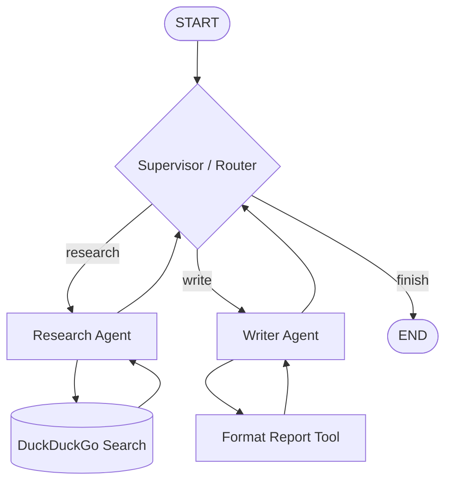

# 🤖 Agentic AI with LangGraph & LangChain

A practical, hands-on repository exploring modern **Agentic AI** patterns and architectures using **LangGraph** and **LangChain**. From foundational state graphs to tool-calling agents, multi-agent collaboration, and human-in-the-loop (HIL) workflows.

---

## 📌 Overview

This project provides step-by-step Jupyter notebooks demonstrating how to build robust, stateful, and production-ready agent workflows. Rather than treating LLMs as stateless chatbots, LangGraph enables treating them as structured state machines capable of reasoning, calling tools, coordinating across specialized agents, and pausing for human validation.

---

## 🚀 Key Concepts Covered

- **State Graphs & Flow Control**: Defining schemas with `TypedDict`, wiring nodes, edges (`START` & `END`), and compiling graphs.
- **State Management & Reducers**: Avoiding unintentional state overwrites using `Annotated` reducers (`operator.add`) for appending lists and chat messages.
- **Conditional Branching**: Dynamic routing with `add_conditional_edges` and type-safe `Literal` decision functions.
- **Tool Calling & Prebuilt Nodes**: Binding Python functions to LLMs via `@tool`, using `ToolNode`, and orchestrating execution with `tools_condition`.
- **Autonomous Agents**: Implementing ReAct agent loops via `create_agent`.
- **Multi-Agent Systems**: Hierarchical multi-agent collaboration featuring a **Research Agent** (armed with DuckDuckGo web search) and a **Writer Agent** (formatting and synthesizing research into structured reports).
- **Human-in-the-Loop (HIL)**: State checkpointing with `MemorySaver`, pausing workflows at critical junctures with `interrupt()`, and resuming execution upon human approval via `Command`.

---

## 📂 Project Structure

```text
agentic-ai/
├── basics_langgraph/
│   ├── calculator.ipynb        # Fundamental LangGraph: state schemas, sequential nodes, and compilation
│   ├── counter.ipynb           # Text-processing pipeline: cleaning, word counting, and summary formatting
│   ├── graph_flow.ipynb        # Conditional routing: dynamic worker dispatch (Math, Text, Fallback) & Mermaid rendering
│   ├── state_management.ipynb  # State updates & reducers: overwrite vs. Annotated[list, operator.add]
│   ├── tool_calling.ipynb      # Tool binding with ChatGroq, MessagesState, and ToolNode
│   ├── agent.ipynb             # Autonomous ReAct agent utilizing arithmetic tools
│   ├── multi_agent.ipynb       # Multi-agent architecture: Researcher + Writer agents with router coordination
│   └── HIL.ipynb               # Human-in-the-loop: state checkpointing, interrupt(), and resumed execution
├── .env.example                # Template for required environment variables
├── pyproject.toml              # UV / PEP 621 project configuration and dependencies
├── requirement.txt             # Standard pip requirements file
├── uv.lock                     # UV lockfile ensuring reproducible environments
└── README.md                   # Project documentation
```

---

## 📓 Notebook Walkthrough

| Notebook | Focus Area | Core Technologies / Patterns |
| :--- | :--- | :--- |
| [`calculator.ipynb`](file:///Users/nirmalkumarpr/Github_personal/agentic-ai/basics_langgraph/calculator.ipynb) | LangGraph Basics | `StateGraph`, `START`, `END`, `TypedDict` state |
| [`counter.ipynb`](file:///Users/nirmalkumarpr/Github_personal/agentic-ai/basics_langgraph/counter.ipynb) | Pipeline Architecture | Sequential multi-stage transformation pipeline |
| [`graph_flow.ipynb`](file:///Users/nirmalkumarpr/Github_personal/agentic-ai/basics_langgraph/graph_flow.ipynb) | Conditional Routing | `add_conditional_edges`, branching router, Mermaid graph rendering |
| [`state_management.ipynb`](file:///Users/nirmalkumarpr/Github_personal/agentic-ai/basics_langgraph/state_management.ipynb) | Reducers & History | State overwrite mitigation, `Annotated[list, operator.add]` |
| [`tool_calling.ipynb`](file:///Users/nirmalkumarpr/Github_personal/agentic-ai/basics_langgraph/tool_calling.ipynb) | Function Calling | `ChatGroq`, `bind_tools`, `MessagesState`, `ToolNode`, `tools_condition` |
| [`agent.ipynb`](file:///Users/nirmalkumarpr/Github_personal/agentic-ai/basics_langgraph/agent.ipynb) | Single Agent | `create_agent`, tool augmentation, conversational loop |
| [`multi_agent.ipynb`](file:///Users/nirmalkumarpr/Github_personal/agentic-ai/basics_langgraph/multi_agent.ipynb) | Multi-Agent Systems | Supervisor routing, `DuckDuckGoSearchRun`, Research & Writer agent team |
| [`HIL.ipynb`](file:///Users/nirmalkumarpr/Github_personal/agentic-ai/basics_langgraph/HIL.ipynb) | Human-in-the-Loop | `MemorySaver`, `interrupt()`, `Command`, paused execution & resumption |

---

## 🛠️ Getting Started

### 1. Prerequisites

- Python 3.10+ (configured for Python `>=3.14` in `pyproject.toml`)
- [uv](https://github.com/astral-sh/uv) (recommended) or standard `pip` / `venv`
- Groq API Key (or OpenAI API Key)

### 2. Installation

Clone the repository and enter the directory:

```bash
git clone git@github-personal:PrNirmal/agentic-ai.git
cd agentic-ai
```

#### Option A: Using `uv` (Recommended)

```bash
# Create and sync the environment
uv sync
```

#### Option B: Using `pip` and virtual environment

```bash
python3 -m venv .venv
source .venv/bin/activate
pip install -r requirement.txt
```

### 3. Environment Configuration

Create a `.env` file in the root directory:

```bash
cp .env.example .env
```

Add your API credentials:

```env
# Primary LLM provider (Groq)
GROQ_API_KEY="your_groq_api_key_here"

# Optional: OpenAI provider
OPENAI_API_KEY="your_openai_api_key_here"

# Optional: LangSmith observability & tracing
LANGCHAIN_TRACING_V2="true"
LANGCHAIN_API_KEY="your_langchain_api_key_here"
```

### 4. Running the Notebooks

Launch Jupyter Lab or Jupyter Notebook:

```bash
# With uv
uv run jupyter lab

# Or with activated virtualenv
jupyter lab
```

Open any notebook under `basics_langgraph/` and run the cells.

---

## 🏗️ Architecture Example: Multi-Agent Workflow



---

## 🧰 Tech Stack

- **Orchestration**: [LangGraph](https://github.com/langchain-ai/langgraph), [LangChain Core](https://github.com/langchain-ai/langchain)
- **Model Providers**: [Groq](https://groq.com/) (`langchain-groq`), [OpenAI](https://openai.com/) (`langchain-openai`)
- **Tools & Utilities**: `duckduckgo-search` (`ddgs`), `python-dotenv`
- **Persistence & Checkpointing**: `langgraph-checkpoint-sqlite`
- **Interactive Environment**: Jupyter, `ipykernel`
- **Observability (Optional)**: [LangSmith](https://www.langchain.com/langsmith)
